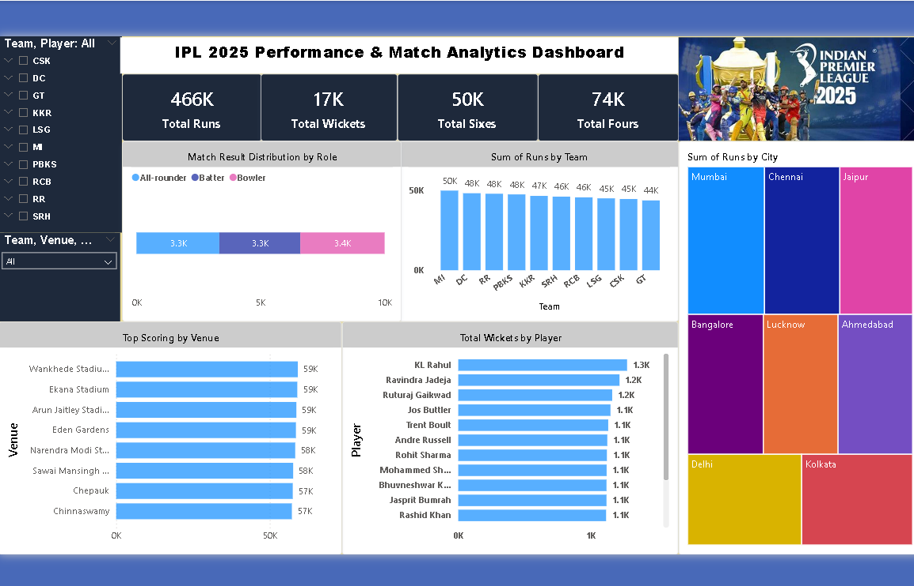

# IPL-2025-Performance-Dashboard
Interactive Power BI dashboard analyzing IPL 2025 team and player performance statistics

# IPL 2025 Performance & Match Analytics Dashboard
### Tools: Power BI | EDA | Data Visualization

## Dashboard Preview

## Overview
Interactive Power BI dashboard to analyze IPL 2025 team 
and player performance using runs, wickets, and match statistics.

## Key KPIs
| Metric | Value |
|--------|-------|
| Total Runs | 466K |
| Total Wickets | 17K |
| Total Sixes | 50K |
| Total Fours | 74K |

## Key Insights
- MI leads total runs with 50K
- KL Rahul top wicket taker with 1.3K
- Wankhede & Ekana Stadium top scoring venues (59K)
- Mumbai, Chennai, Jaipur top cities by runs
- Balanced role distribution: Batters, Bowlers, All-rounders ~3.3K each
